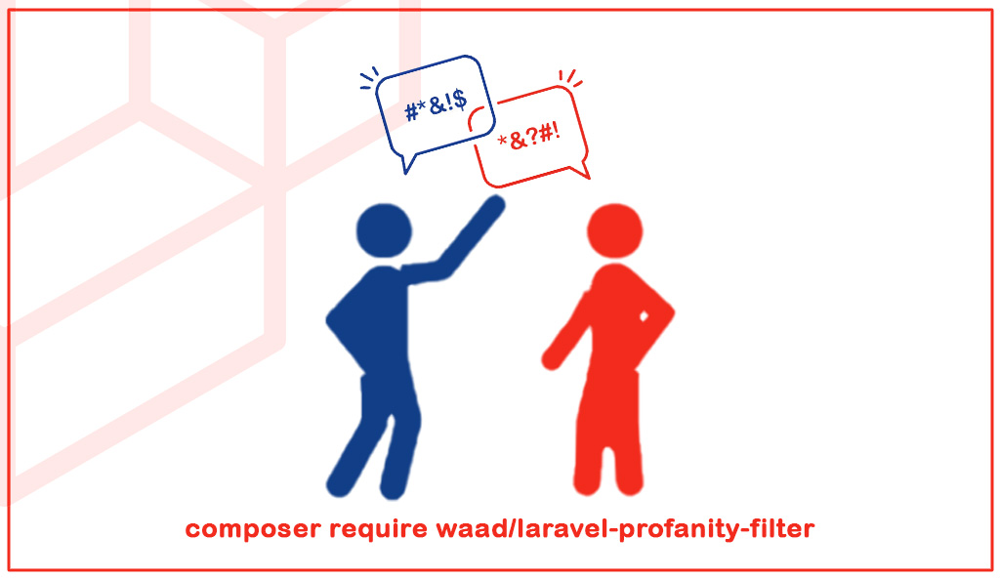

# Laravel Profanity Filter

A powerful, flexible, and easy-to-use PHP Laravel package for detecting, filtering, and masking profanity in multiple languages. Includes advanced features such as leet speak detection, custom word lists, language auto-detection, and real-time configuration.

---

## 🚀 Features

- **Multi-language support:** Detects profanity in English, French, Arabic, and more
- **Customizable masking:** Replace profane words with your own masking character(s)
- **Leet speak & substitutions:** Detects obfuscated words (e.g., "f@ck", "sh!t", "d4mn")
- **Custom word lists:** Add or override profane words per language
- **Case sensitivity:** Toggle case-sensitive or insensitive detection
- **Separator handling:** Detects words with separators (e.g., d-a-m-n, s_h_i_t)
- **Laravel integration:** Seamless usage via Facade, Service Provider, and config
- **Real-time configuration:** Update settings and word lists at runtime
- **Extensible:** Easily add new languages, separators, or substitutions
- **Import custom words from files:** Load additional profanity words from `.txt` or `.json` files per language

---

## 🛠 Requirements

- `PHP 8.0+`
- `Laravel 8+`

## Installation

### Via Composer
```bash
composer require waad/laravel-profanity-filter
```

Publish the configuration file:
```bash
php artisan vendor:publish --tag="profanity-filter"
```

Publish the words (`Optional`) ⚠️:
```bash
php artisan vendor:publish --tag="profanity-words"
```

### Configuration

You can configure the package by editing the `profanity-filter.php` file in the `config` directory.


## Usage

### Using `hasProfanity` method

```php
use Waad\ProfanityFilter\Facades\ProfanityFilter;

$text = "This is a test string with some profanity like fuck and shit.";
$hasProfanity = ProfanityFilter::hasProfanity($text);

echo $hasProfanity; // true
```

### Using `filter` method

```php
use Waad\ProfanityFilter\Facades\ProfanityFilter;

$text = "This is a test string with some profanity like fuck and shit.";
$filteredText = ProfanityFilter::filter($text);

echo $filteredText; // This is a test string with some profanity like **** and ****.
```

### Using `getProfanityWords` method

```php
use Waad\ProfanityFilter\Facades\ProfanityFilter;

$text = "This is a test string with some profanity like fuck and shit.";
$profanityWords = ProfanityFilter::getProfanityWords($text);

print_r($profanityWords);
// Output: Array ( [0] => fuck [1] => shit )
```

### Using `setLanguage` method

```php
use Waad\ProfanityFilter\Facades\ProfanityFilter;

ProfanityFilter::setLanguage('en'); // default is null (auto detect language)

$text = "This is a test string with some profanity like fuck and shit.";
$filteredText = ProfanityFilter::filter($text);

echo $filteredText; // This is a test string with some profanity like **** and ****.
```

### Using `setCaseSensitive` method

```php
use Waad\ProfanityFilter\Facades\ProfanityFilter;

ProfanityFilter::setCaseSensitive(true); // default is false

$text = "This is a test string with some profanity like fuck and Fuck.";
$filteredText = ProfanityFilter::filter($text);

echo $filteredText; // This is a test string with some profanity like **** and Fuck.
```


### Using `setDetectLeetSpeak` method

```php
use Waad\ProfanityFilter\Facades\ProfanityFilter;

ProfanityFilter::setDetectLeetSpeak(true); // default is true

$text = "This is a test string with some profanity like f@ck and sh!t.";
$filteredText = ProfanityFilter::filter($text);

echo $filteredText; // This is a test string with some profanity like **** and ****.
```

### Using `setConfig` method

You can update the package configuration in real time using Laravel's `config()` helper, or by editing the `profanity-filter.php` file in the `config` directory.

```php
use Waad\ProfanityFilter\Facades\ProfanityFilter;

config(['profanity-filter.custom_words.en' => ['custom']]);
ProfanityFilter::setConfig(config('profanity-filter'));

$text = "This is a test string with some profanity like fuck and shit.";
$filteredText = ProfanityFilter::filter($text);

echo $filteredText; // This is a test string with some profanity like **** and ****.
```


### Using `importWordsFromFile` method
You can import additional profanity words from a file (JSON or TXT) at runtime using the `importWordsFromFile` method. This is useful for dynamically extending the list of profane words without modifying the config file.

```php
use Waad\ProfanityFilter\Facades\ProfanityFilter;

// Import words from a TXT file
ProfanityFilter::importWordsFromFile(storage_path('app/profanity-words.txt'), 'en');

// Import words from a JSON file
ProfanityFilter::importWordsFromFile(storage_path('app/profanity-words.json'), 'en');

$text = "This is foo and bar and alpha.";
$filteredText = ProfanityFilter::filter($text);

echo $filteredText; // This is *** and *** and *****.

```


### Example All Methods

```php
use Waad\ProfanityFilter\Facades\ProfanityFilter;

$text = "This is a test string with some profanity like f@ck and sh!t.";
ProfanityFilter::setLanguage('en')
    ->setDetectLeetSpeak(true)
    ->setCaseSensitive(false);

ProfanityFilter::hasProfanity($text); // true
ProfanityFilter::filter($text); // This is a test string with some profanity like *@** and **!*.
```

## Contributing

Contributions are welcome! Please feel free to submit a pull request.

## Testing

To run the tests, you can use the following command:

```bash
composer test
```

## To Do

- [x] Add support for multiple languages
- [x] Add support for custom words
- [x] Add support for leet speak
- [x] Add support for case sensitivity
- [x] Add support for separators
- [x] Add support for custom replacements
- [x] Add support for custom separators
- [x] Add support for custom substitutions
- [x] Add support for custom word lists
- [x] Add support for custom word lists per language
- [x] Add support for custom word from files (json, txt)
- [ ] Add support for custom word lists in real time

## License

This package is open-sourced software licensed under the [MIT license](https://opensource.org/licenses/MIT).
